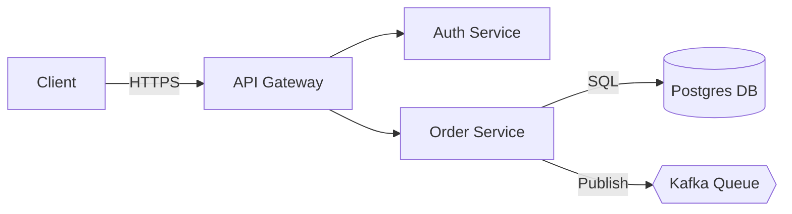

```mermaid
flowchart LR
    N0["Client"]
    N1["API Gateway"]
    N2["Auth Service"]
    N3["Order Service"]
    N4[("Postgres DB")]
    N5{{"Kafka Queue"}}
    N0 -->|"HTTPS"| N1
    N1 --> N2
    N1 --> N3
    N3 -->|"SQL"| N4
    N3 -->|"Publish"| N5
```
